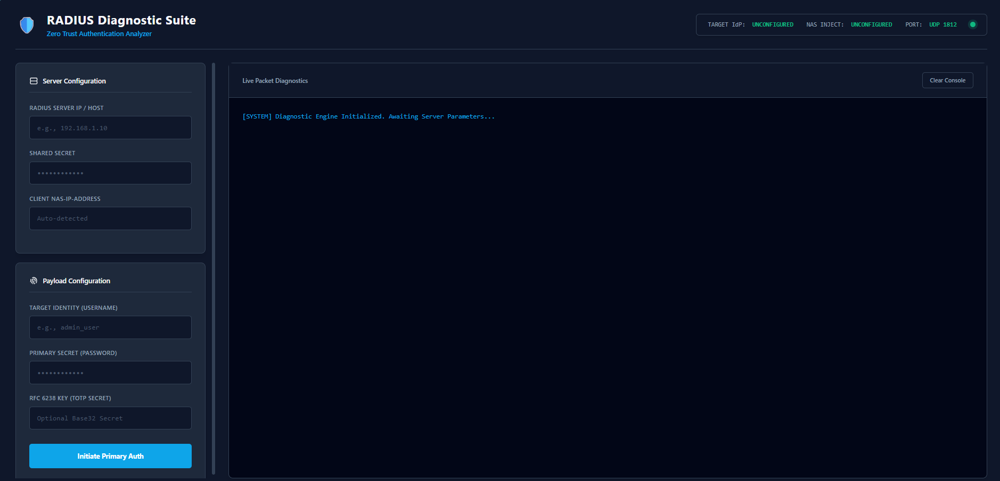

# 🛡️ RADIUS Diagnostic Suite
*A Zero Trust Authentication Analyzer & Network Access Server (NAS) Simulator - RADIUS Client*

   

An elegant, Flask-driven diagnostic utility designed to deeply analyze, troubleshoot, and validate RADIUS authentication flows and Multi-Factor Authentication (MFA) policies.

## 📖 Overview
The RADIUS Diagnostic Suite is a comprehensive credential and access management testing tool. Built with a robust Python `pyrad` backend and powered by a modern, responsive Flask graphical user interface, it provides a seamless experience for testing advanced RADIUS authentication pipelines.

It operates as a simulated Network Access Server (NAS), allowing security engineers and red teamers to safely inject credentials, capture stateful session IDs, and trace real-time packet responses from backend Identity Providers (IdP) without requiring local configuration files.

## ✨ Key Features
*   **🔍 Deep Packet Diagnostics:** Real-time, color-coded terminal HUD that traces every UDP packet hop, Code evaluation, and payload transmission.
*   **🔐 Stateful MFA Validation:** Fully supports complex Challenge-Response loops (Code 11). Seamlessly tests RFC 6238 TOTP generation, Out-of-Band (OOB) SMS, and Email OTP triggers.
*   **🗄️ Stateless Architecture:** Zero reliance on `.env` files. All Identity Provider IP, Port, and Shared Secret configurations are passed securely at runtime via the dashboard.
*   **🌐 Flask-Powered GUI:** A professional, cyberpunk-inspired web interface designed for enterprise security environments and seamless operator interaction.
*   **⚡ Automated Deployment:** Frictionless installation scripts utilizing `Makefile` (Linux/macOS) and `Batch` (Windows) to instantly bootstrap dependencies and virtual environments.

## 🎥 Demo & Visuals
***See it in Action***  

Check out the full working demonstration of the RADIUS Diagnostic Suite on YouTube:

[](#) *Coming Soon*

**Screenshots**
*   *Diagnostic Dashboard & Server HUD*

<div align="center">
  
  <p><i>RADIUS Diagnostic Suite</i></p>
</div>

## 🚀 Getting Started

### Prerequisites
Ensure you have the following installed in your local environment:
*   Python 3.8+
*   Git

### Installation
Clone the repository to your local machine:
```bash
git clone https://github.com/Siba-Ka-Playground/RADIUS_Diagnostic_Suite.git
cd RADIUS_Diagnostic_Suite
```

### Execution Setup
This project includes automated scripts to completely handle virtual environment creation and dependency installation. Run the commands specific to your operating system:

🍏🐧 For Linux & macOS (Using Makefile)
1. Initial Setup (Run Once):
```bash
make setup
```
2. Launch the Application:
```bash
make RADIUS
```

🪟 For Windows (Using Batch Script)
1. Initial Setup (Run Once):
```dos
RADIUS.bat setup
```
2. Launch the Application:
```dos
RADIUS.bat RADIUS
```

Access the GUI: Upon launching, the tool will automatically open your default web browser and navigate to http://127.0.0.1:5000/.

### ⚠️ Disclaimer

For Educational and Defensive Purposes Only.

The RADIUS Diagnostic Suite is designed as a proof-of-concept for secure credential handling, IdP policy evaluation, and defensive security research. The creator is not responsible for any misuse of this tool, unauthorized network access, or data breaches resulting from its usage. Always ensure you have explicit, authorized permission before testing authentication systems and follow proper operational security (OpSec) guidelines.

### 📜 License

This project is licensed under the GNU General Public License v3.0 (GPL-3.0).

You are free to use, modify, and distribute this software, provided that any derivative works are also open-source and licensed under the same GPL-3.0 terms. See the `LICENSE` file for more details.

Copyright © 2026 Sibasundar Barik

Built with security in mind. Contributions, issues, and feature requests are welcome!
